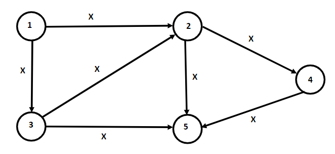

Uma transportadora especializada em grãos opera nas cinco regiões do Brasil, tendo o porto de Santos como seu destino final. Você pode observar as rotas de operações a partir do grafo a seguir: 

O porto de Santos é o vértice indicado pelo número 5 (cinco). As demais regiões são representadas pelos demais vértices que vão de 1 (um) a 4 (quatro). 

Você foi convidado a desenvolver uma solução que ajude a empresa em uma tomada de decisão, pois devido ao aumento consecutivo do valor do diesel, a empresa quer uma estimativa de quais os menores custos para continuar operando no porto de Santos. Foi feito um levantamento histórico com o custo médio de operação em cada ponto de origem até o destino final.  

No contexto da figura, os vértices 1, 2, 3, 4 e 5 representam, respectivamente as regiões cidades em que a transportadora opera hoje. O trajeto é representado pelas ARESTAS que liga (1 a 2), (1 a 3), (2 a 4), (2 a 5), e assim por diante. O custo médio (peso) entre cada conexão está representado por X. Você deve substituir o X pelos 7 primeiros dígitos do seu RA (indo da esquerda para direita) multiplicado por 100, na sequência: (1-2), (1-3), (2-4), (2-5), (3-2), (3-5), (4-5).  

Exemplo:  

RA 2025703-5 = Será utilizado os seguintes números do seu RA 2025703  

RA 202570-5 = Em caso de 6 dígitos, acrescentar o dígito 1 ao final 2025701  

(1-2) = 2 * 100 = 200
(1-3) = 0 * 100 = 0
(2-4) = 2 * 100 = 200
......

Considerando que você precisa desenvolver a solução, utilize o algoritmo de Dijkstra e informe o caminho de menor custo saindo de 1 (que é a matriz da empresa em Mato Grosso do Sul) e chegando em 5. O resultado do seu programa deverá indicar as rotas que poderão ser utilizadas pela companhia e o seu respectivo peso.  