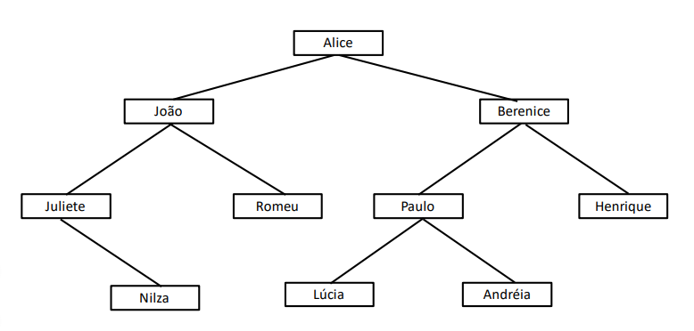

A empresa TICLAB tem um departamento de TI com uma diretoria que engloba tanto o desenvolvimento back-end quanto front-end,
e cada gerência dentro de cada segmento os seus subordinados.
A Alice é a diretora geral de TI, enquanto o João é o responsável pela equipe de back-end e a Berenice a responsável pela equipe de front-end.
Para facilitar a sua compreensão o departamento de RH da organização fez o seguinte organograma. 

Você está fazendo um teste na empresa para atuar no departamento de TI, especificamente no setor de back-end sob a supervisão da Juliete.
Ela te pediu um teste que simule a execução do algoritmo de busca em profundidade a partir da diretora Alice do organograma apresentado,
descreva a sequência que corresponda a ordem de visitação dos nós. 

A técnica de busca em profundidade faz com que todo um segmento do grafo seja visitado até o final, antes que uma nova porção seja investigada.
A partir de um primeiro nó, o algoritmo coloca todos os vértices adjacentes em uma pilha e marca o nó atual como visitado.
Em seguida, o programa pega o nó do topo, desempilhando-o, e repete o processo. A busca segue até que o alvo seja encontrado ou que a pilha esteja vazia. 

OLIVEIRA, P. M.; PEREIRA, R. L. Estrutura de Dados I. Maringá-Pr.: Unicesumar, 2019. 

Ao terminar a explicação a sua chefe Juliete lhe disse: “Bom teste. Estou torcendo pela sua contratação”. 

Como característico da busca em profundidade, todo o segmento irá ser buscado até o final antes de dar continuidade da busca em outro segmento.
No caso apresentado, um exemplo de sequência de busca após a execução do algoritmo de busca em profundidade seria a seguinte:
Alice -> Berenice -> Henrique -> Paulo -> Andréia -> Lúcia -> João -> Romeu -> Juliete -> Nilza
Após a diretora Alice, uma das equipes seria escolhida para ser o alvo da busca (equipe de back-end ou equipe de front-end). Caso o algoritmo comece pela responsável pela equipe de front-end Berenice, o algoritmo irá buscar entre todos os membros da equipe de front-end até o final daquele ramo, ou seja, irá buscar um filho do nó e ir até o final desse filho, até achar um nó do qual não possui mais filhos. Após achar esse nó sem filhos, o algoritmo irá retroceder a busca até o último nó do qual foi detalhado possuir mais de um filho e realizar novamente a busca até que ache um nó sem filhos.
Dado o nome do algoritmo "busca em profundidade", infere-se essa prioridade da busca até que ache o final daquela ramificação antes de dar sequência para as outras ramificações, ou seja, uma busca até a região mais profunda do grafo (nó sem filhos) para que a busca retroceda até um nó com mais de uma ramificação e busque até o final daquela ramificação.

Um código em C foi elaborado para representar a busca em profundidade no caso apresentado: